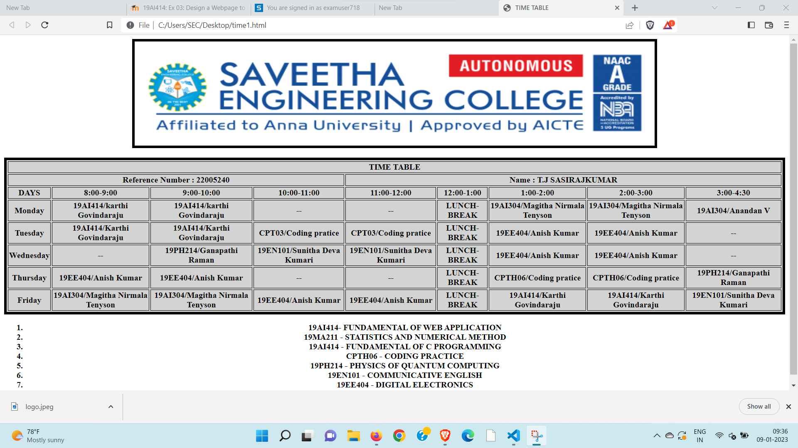

# Experiment_Time_Table

## AIM
To Write a html webpage page to display your timetable.

# ALGORITHM
### STEP 1
create a simple table using table tag
### STEP 2
Add header row using th tag
### STEP 3
Add your timetable
### STEP 4
Execute the program

# CODE
```
<html>
<head>
<title>TIME TABLE</title>
</head>

<body ><center></center><br>
   <table border = "5" cellspacing="3" bgcolor="lightgrey" bordercolor="black" >
     <tr>
        <th colspan ="10">TIME TABLE</th>
     </tr>
     <tr>
     <th colspan="4" > Reference Number : 22005240 </th><th colspan="6">Name :  T.J SASIRAJKUMAR </th>
     </tr>
     <tr>
        <th>DAYS</th>
        <th>8:00-9:00</th>
        <th>9:00-10:00</th>
        <th>10:00-11:00</th>
        <th>11:00-12:00</th>
        <th>12:00-1:00</th>
        <th>1:00-2:00</th>
        <th>2:00-3:00</th>
        <th>3:00-4:30</th>
     </tr>
     <tr>
        <th>Monday</th>
        <th>19AI414/karthi Govindaraju</th>
        <th>19AI414/karthi Govindaraju</th>
        <th>--</th>
        <th>--</th>
        <th>LUNCH-BREAK</th>
        <th>19AI304/Magitha Nirmala Tenyson</th>
        <th>19AI304/Magitha Nirmala Tenyson</th>
        <th>19AI304/Anandan V</th>
      </tr>
      <tr>
        <th>Tuesday</th>
        <th>19AI414/Karthi Govindaraju</th>
        <th>19AI414/Karthi Govindaraju</th>
        <th>CPT03/Coding pratice</th>
        <th>CPT03/Coding pratice</th>
        <th>LUNCH-BREAK</th>
        <th>19EE404/Anish Kumar</th>
        <th>19EE404/Anish Kumar</th>
        <th>--</th>
      </tr>
      <tr>
        <th>Wednesday</th>
        <th>--</th>
        <th>19PH214/Ganapathi Raman</th>
        <th>19EN101/Sunitha Deva Kumari</th>
        <th>19EN101/Sunitha Deva Kumari</th>
        <th>LUNCH-BREAK</th>
        <th>19EE404/Anish Kumar</th>
        <th>19EE404/Anish Kumar</th>
        <th>--</th>
        
      </tr>
      <tr>
        <th>Thursday</th>
        <th>19EE404/Anish Kumar</th>
        <th>19EE404/Anish Kumar</th>
        <th>--</th>
        <th>--</th>
        <th>LUNCH-BREAK</th>
        <th>CPTH06/Coding pratice</th>
        <th>CPTH06/Coding pratice</th>
        <th>19PH214/Ganapathi Raman</th>
      </tr>
      <tr>
        <th>Friday</th>
        <th>19AI304/Magitha Nirmala Tenyson</th>
        <th>19AI304/Magitha Nirmala Tenyson</th>
        <th>19EE404/Anish Kumar</th>
        <th>19EE404/Anish Kumar</th>
        <th>LUNCH-BREAK</th>
        <th>19AI414/Karthi Govindaraju</th>
        <th>19AI414/Karthi Govindaraju</th>
        <th>19EN101/Sunitha Deva Kumari</th>
        </tr>
    </table>
        <ol>
          <center>
            <b><LI>19AI414- FUNDAMENTAL OF WEB APPLICATION</LI></b>
            <b><LI>19MA211 - STATISTICS AND NUMERICAL METHOD</LI></b>
            <b><LI>19AI414 - FUNDAMENTAL OF C PROGRAMMING</LI></b>
            <b><LI>CPTH06 - CODING PRACTICE</LI></b>
            <b><LI>19PH214 - PHYSICS OF QUANTUM COMPUTING</LI></b>
            <b><LI>19EN101 - COMMUNICATIVE ENGLISH</LI></b>
            <b><LI>19EE404 - DIGITAL ELECTRONICS</LI></b>
          </center>
       
        </ol>
    
</body>
</html>
```
# OUTPUT


# RESULT
A Web Server Has Been created